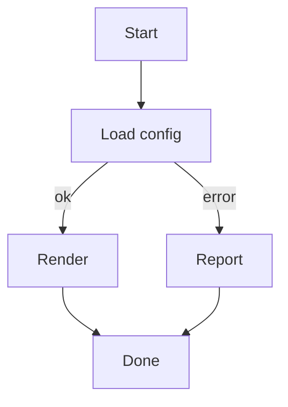
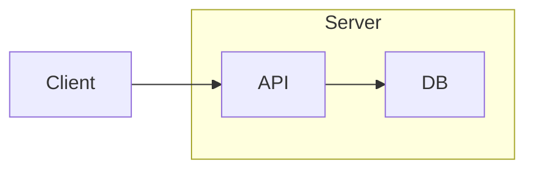
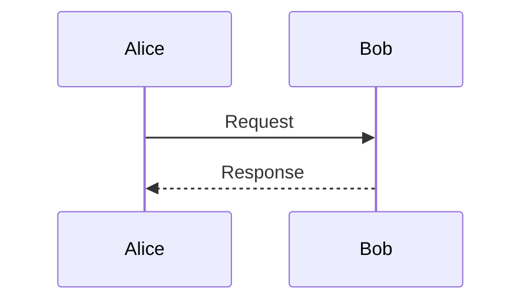
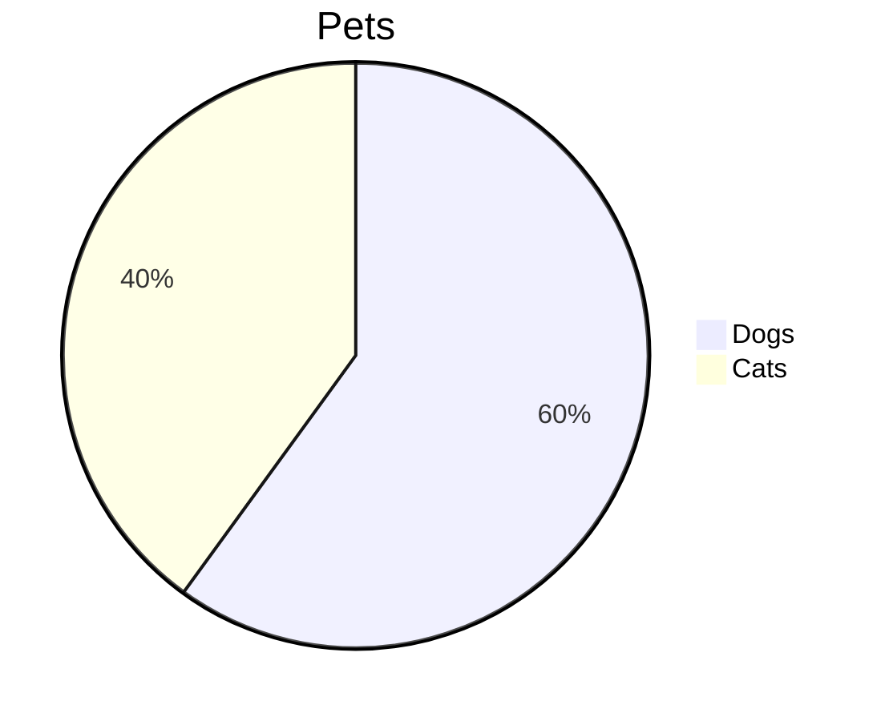

# Mermaid diagrams

A simple top-down flowchart with labeled edges:

A left-to-right flowchart using a subgraph:

A sequence diagram:

An unsupported diagram type falls back to a highlighted code block:

