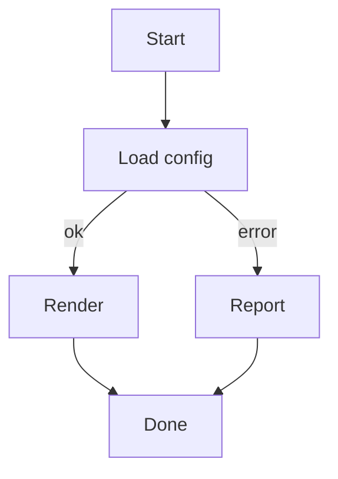
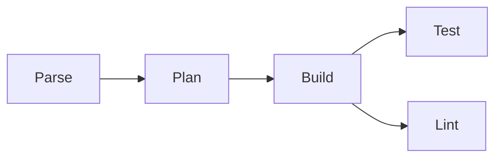
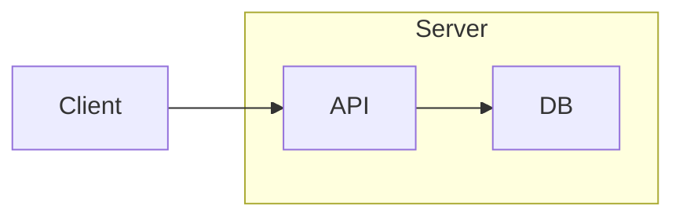
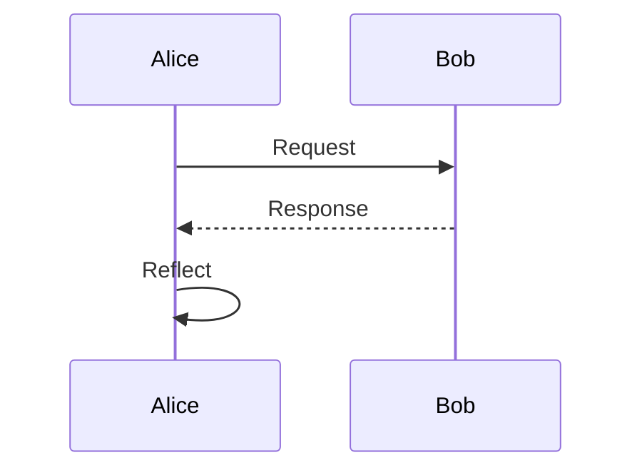
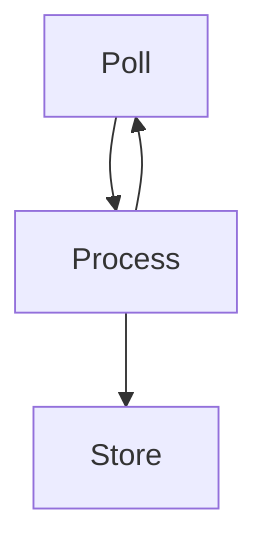

# Mermaid diagrams

termdown renders ` ```mermaid ` fenced blocks as ASCII/Unicode diagrams via a
native Swift port of [mermaid-ascii] — no external tools required. Flowcharts
and sequence diagrams are supported; anything else falls back to a highlighted
code block.

> [!NOTE]
> Only **rectangle** node shapes are supported. Write `B[Decision]`, not
> `B{Decision}` — the latter becomes a node literally named `B{Decision}`.

## Flowchart — top‑down, labeled edges



## Flowchart — left‑to‑right, chained & grouped edges



## Flowchart — subgraph grouping



## Sequence diagram



## Self‑reference and back edges



## Configuration

Diagram rendering is on by default and uses Unicode box-drawing. Switch the
character set or turn it off in `~/.config/termdown/config.yaml` (or a
project-local `.termdown.yaml`):

```yaml
mermaid: true            # set false to show the raw source instead
mermaid-charset: unicode # or: ascii
```

The same diagram with `mermaid-charset: ascii` uses `+ - | < > v ^` characters,
handy for terminals or fonts without good box-drawing support.

[mermaid-ascii]: https://github.com/AlexanderGrooff/mermaid-ascii
