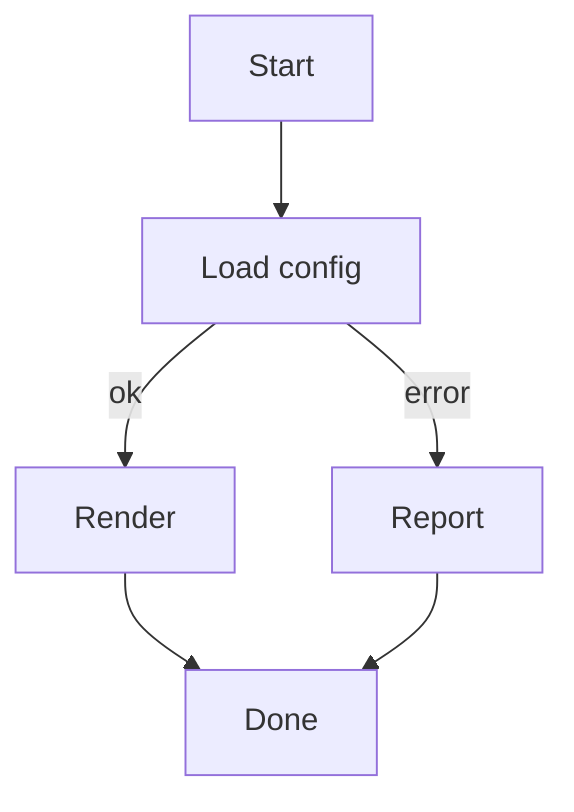
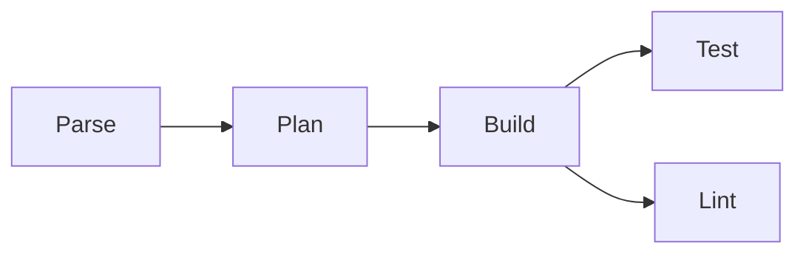
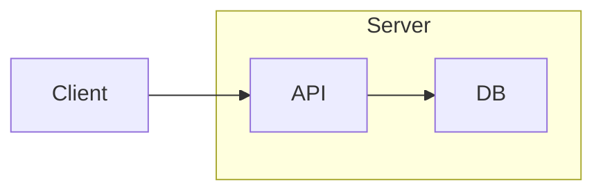
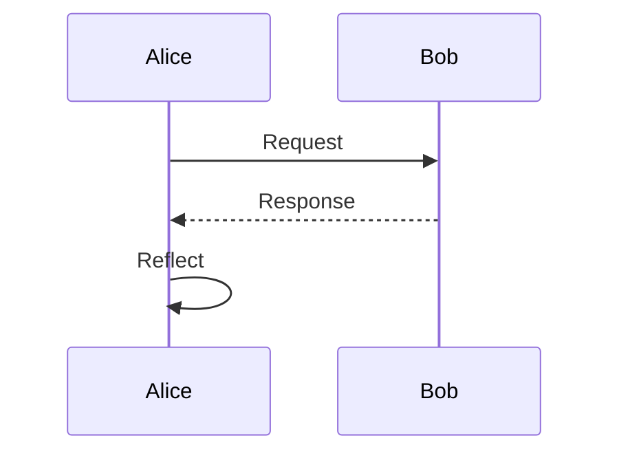
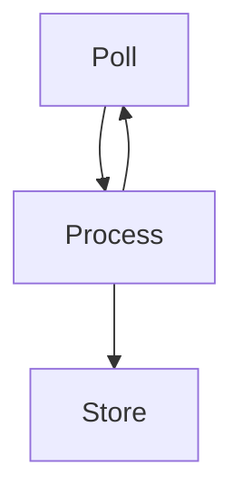
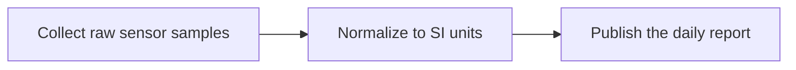
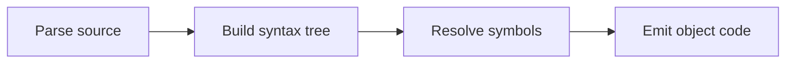
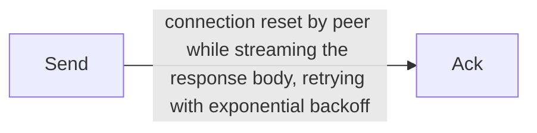

# Mermaid diagrams

termdown renders ` ```mermaid ` fenced blocks as ASCII/Unicode diagrams via a
native Swift port of [mermaid-ascii] — no external tools required. Flowcharts
and sequence diagrams are supported; anything else falls back to a highlighted
code block.

> [!NOTE]
> Only **rectangle** node shapes are supported. Write `B[Decision]`, not
> `B{Decision}` — the latter becomes a node literally named `B{Decision}`.

## Flowchart — top‑down, labeled edges



## Flowchart — left‑to‑right, chained & grouped edges



## Flowchart — subgraph grouping



## Sequence diagram



## Self‑reference and back edges



## Fitting a diagram to the width

A diagram is laid out to fit the text column, so the same source renders
differently in a narrow terminal than a wide one. **Resize your terminal (or
pass `--width`) while viewing this file to watch the three stages below.**

### Wrapping and tightening

The first thing to give is the node labels: they wrap, and the gaps between
nodes tighten. Wrapping costs height rather than information, since boxes
already draw multi-line labels. Around 100 columns these three sit on one line
each; narrow it and they fold.



### Restacking a long chain

Wrapping cannot rescue a long left-to-right chain — its width grows with the
whole chain, not with any one node. So a `graph LR` that still will not fit is
stacked top-down instead. It is the last resort, because it genuinely changes
how the diagram reads, and it is used only when it actually fits.



### The floor

Edge labels are drawn inline along a one-row arrow, so unlike node labels they
cannot wrap. An edge label wider than the column is therefore a hard floor: no
amount of shrinking gets under it. The diagram is clipped inside an intact
border and the cut is marked with `…`, rather than being allowed to overflow
and drag the card's right edge off-screen.

Seeing `…` means *shorten the edge label or widen the terminal* — it is the one
case termdown cannot solve on your behalf.



## Configuration

Diagram rendering is on by default and uses Unicode box-drawing. Switch the
character set or turn it off in `~/.config/termdown/config.yaml` (or a
project-local `.termdown.yaml`):

```yaml
mermaid: true            # set false to show the raw source instead
mermaid-charset: unicode # or: ascii
```

The same diagram with `mermaid-charset: ascii` uses `+ - | < > v ^` characters,
handy for terminals or fonts without good box-drawing support.

[mermaid-ascii]: https://github.com/AlexanderGrooff/mermaid-ascii
